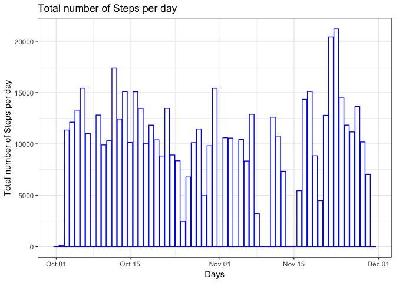
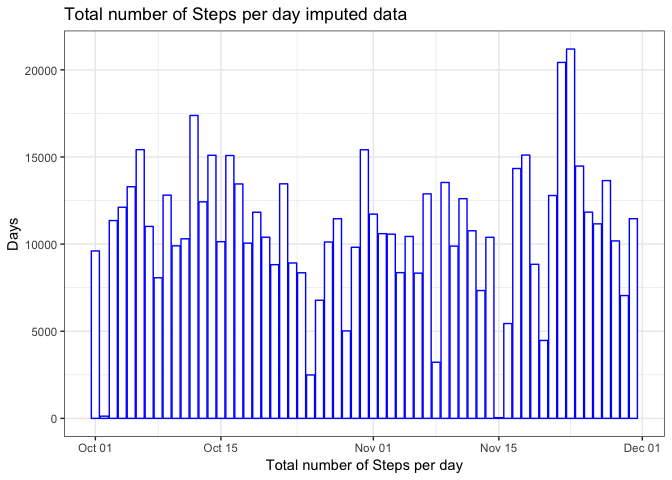

## 1. Loading and preprocessing the data


```r
library(dplyr); library(ggplot2) ; library(mice)
unzip("activity.zip")
amd<-read.csv("activity.csv", header = TRUE)
amd$date<-as.Date(amd$date)
```

## 2. What is mean total number of steps taken per day?

### 2.1 Make a histogram of the total number of steps taken each day


```r
TSPD<-amd %>% group_by(date) %>% summarize(total.steps=sum(steps,na.rm = TRUE))

g<-ggplot(TSPD, aes(date,total.steps))
g+geom_col(color="blue", fill="white")+theme_bw()+
        labs(x = "Total number of Steps per day", y= "Days", 
             title = "Total number of Steps per day")
```

<!-- -->

```r
ggsave("Total number of Steps per day.png", device = "png")
```

```
## Saving 7 x 5 in image
```

### 2.2 Calculate and report the mean and median total number of steps taken per day


```r
meanTSPD<-as.character(round(mean(TSPD$total.steps),digits=0))
medianTSPD<-as.character(round(median(TSPD$total.steps),digits=0))
```
Mean of toal steps taken per day is 9354  and the Median is 10395

## 3. What is the average daily activity pattern?

### 3.1 Make a time series plot


```r
avgtime<- amd %>% group_by(interval) %>% summarize(avg.steps= mean(steps,
                                                                   na.rm = TRUE))
g2<-ggplot(avgtime,aes(interval,avg.steps))
g2+geom_line(color="blue")+theme_bw()+
        labs(x = "Average Steps per time interval", y= "Time intervals", 
             title = "Time series of average steps accross all days")
```

<!-- -->

```r
ggsave("Time series of average steps accross all days.png", device = "png")
```

```
## Saving 7 x 5 in image
```

### 3.2 Which 5-minute interval, on average across all the days in the dataset, contains the maximum number of steps?


```r
i<-which.max(avgtime$avg.steps)
interval<-avgtime[i,1]
```
The result shows 835 interval is the interval with maximum average number of steps

## 4. Imputing missing values

### 4.1 Calculate and report the total number of missing values in the dataset:


```r
empty<-sum(is.na(amd$steps))
```
The number of rows with NAs is 2304 rows

### 4.2 Devise a strategy for filling in all of the missing values in the dataset

Imputing the data with "mice" package using pmm (predective mean matching method)  

Note:Seed is set to be 3435


```r
tempdata<-mice(amd,method = "pmm", seed = 3435)
amdimp<-complete(tempdata,1)
```

### 4.3 Create a new dataset that is equal to the original dataset but with the missing data filled in.


```r
empty2<-sum(is.na(amdimp$steps))
```
After imputing the data contains 0 rows with NAs data.  

### 4.4 Make a histogram of the total number of steps taken each day and Calculate and report the mean and median total number of steps taken per day. 


```r
TSPDimp<-amdimp %>% group_by(date) %>% summarize(total.steps=sum(steps,na.rm = TRUE))
g3<-ggplot(TSPDimp, aes(date,total.steps))
g3+geom_col(color="blue", fill="white")+theme_bw()+
        labs(x = "Total number of Steps per day", y= "Days", 
             title = "Total number of Steps per day imputed data")
```

<!-- -->

```r
ggsave("Total number of Steps per day imputed data.png", device = "png")
```

```
## Saving 7 x 5 in image
```

### 4.5 Do these values differ from the estimates from the first part of the assignment? What is the impact of imputing missing data on the estimates of the total daily number of steps?


```r
meanTSPDimp<-as.character(round(mean(TSPDimp$total.steps),digits = 0))
medianTSPDimp<-as.character(round(median(TSPDimp$total.steps),digits=0))
```

The mean of total steps per day before imputation was 9354 while after imputing 10715  The median of total steps per day before imputation was 10395 and after imputing 10600. There is a small difference between means and medians of the data before and after imputing the NA values.

## 5. Are there differences in activity patterns between weekdays and weekends?

### 5.1 Create a new factor variable in the dataset with two levels -- "weekday" and "weekend" indicating whether a given date is a weekday or weekend day.


```r
day.of.week<-weekdays(amdimp$date)
dayslv<-levels(as.factor(weekdays(amdimp$date)))
weekdays<-dayslv[c(1,2,5,6,7)]
weekends<-dayslv[c(3,4)]
day.of.week[which(day.of.week %in% weekdays)]<-"weekday"
day.of.week[which(day.of.week %in% weekends)]<-"weekend"
day.of.week<-as.factor(day.of.week)
amdimpdays<-cbind(amdimp,day.of.week)
```

### 5.2 Make a panel plot containing a time series plot of the 5-minute interval and the average number of steps taken, averaged across all weekday days or weekend days


```r
avgtimedays<- amdimpdays %>% group_by(day.of.week,interval) %>% 
        summarize(avg.steps= mean(steps,na.rm = TRUE))
g4<-ggplot(avgtimedays,aes(interval,avg.steps))
g4+geom_line(color="blue")+facet_grid(day.of.week~.)+theme_bw()+
        labs(x = "intervals", y= "Number of Steps", 
             title = "Average number of Steps per interval for weekdays and weekends")
```

<!-- -->

```r
ggsave("Average number of Steps per interval for weekdays and weekends.png", device = "png")
```

```
## Saving 7 x 5 in image
```
